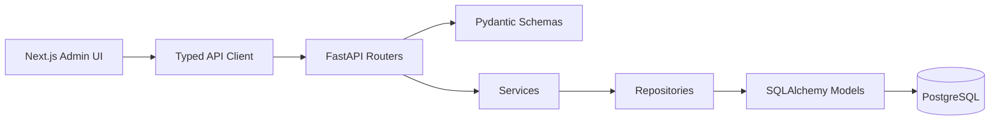

# Architecture Guidelines

## System Shape

```text
Browser
  -> Next.js admin app
  -> FastAPI REST API /api/v1
  -> SQLAlchemy repositories
  -> PostgreSQL
```



## Backend Stack

- FastAPI with dependency injection.
- Python 3.11+.
- Pydantic v2 for request and response schemas.
- SQLAlchemy 2 for ORM models and queries.
- Alembic for schema migrations.
- PostgreSQL as the only production database target.

## Backend Layers

```text
backend/
├── app/
│   ├── api/
│   │   └── v1/
│   │       └── routers/
│   ├── core/
│   ├── db/
│   ├── dependencies/
│   ├── models/
│   ├── repositories/
│   ├── schemas/
│   ├── services/
│   └── main.py
├── alembic/
└── tests/
```

Layer rules:

- Routers handle HTTP concerns only: routing, dependencies, status codes, and response models.
- Schemas validate API input and output; they must stay separate from ORM models.
- Services own business rules and transaction-level behavior.
- Repositories own persistence queries and SQLAlchemy details.
- Models represent database tables only.
- Dependencies provide database sessions, authenticated users, and role checks.

Allowed dependency direction:

```text
router -> service -> repository -> model
router -> schema
service -> schema only when useful for input/output typing
```

Disallowed dependency direction:

```text
repository -> service
model -> schema
service -> router
frontend -> database
```

## Frontend Stack

- Next.js App Router.
- TypeScript.
- Tailwind CSS.
- shadcn/ui-style primitives.
- Recharts for dashboard charts.
- React Hook Form and Zod for forms and validation.

## Frontend Layout

```text
frontend/
├── app/
│   ├── (auth)/
│   └── (admin)/
├── components/
│   ├── layout/
│   └── ui/
├── features/
├── lib/
│   ├── api/
│   ├── formatters/
│   └── validators/
└── tests/
```

Frontend rules:

- Keep route files small; move feature behavior into `features/`.
- Keep API calls behind `lib/api/`.
- Keep reusable primitives in `components/ui/`.
- Keep product-specific components in `features/`.
- Prefer server-rendered or server-loaded data when it keeps the code simpler.
- Use client components for forms, charts, dialogs, and interactive tables.

## Core Domains

- `users`: admin and staff accounts.
- `buildings`: managed properties.
- `rooms`: rentable units under buildings.
- `tenants`: renter profiles.
- `contracts`: room occupancy, rent, deposit, and lifecycle.
- `meter_readings`: electricity and water readings by room and month.
- `invoices`: monthly rent, utilities, services, adjustments, and totals.
- `payments`: invoice payment records and invoice status updates.
- `expenses`: manual operating expenses.
- `dashboard`: aggregate KPIs and chart data.

## API Defaults

- REST API lives under `/api/v1`.
- List endpoints support pagination.
- Search and filters are added where the UI needs them.
- Use explicit request and response schemas.
- Use stable status values via enums where practical.
- Return Vietnamese UI text from the frontend, not hard-coded backend messages, unless the message is an API validation error.

## Infrastructure

- Root `docker-compose.yml` runs PostgreSQL, backend, and frontend.
- Backend service runs migrations before serving the app when used in local Docker.
- Seed data must be idempotent.
- Environment variables must be documented in `.env.example` files.
